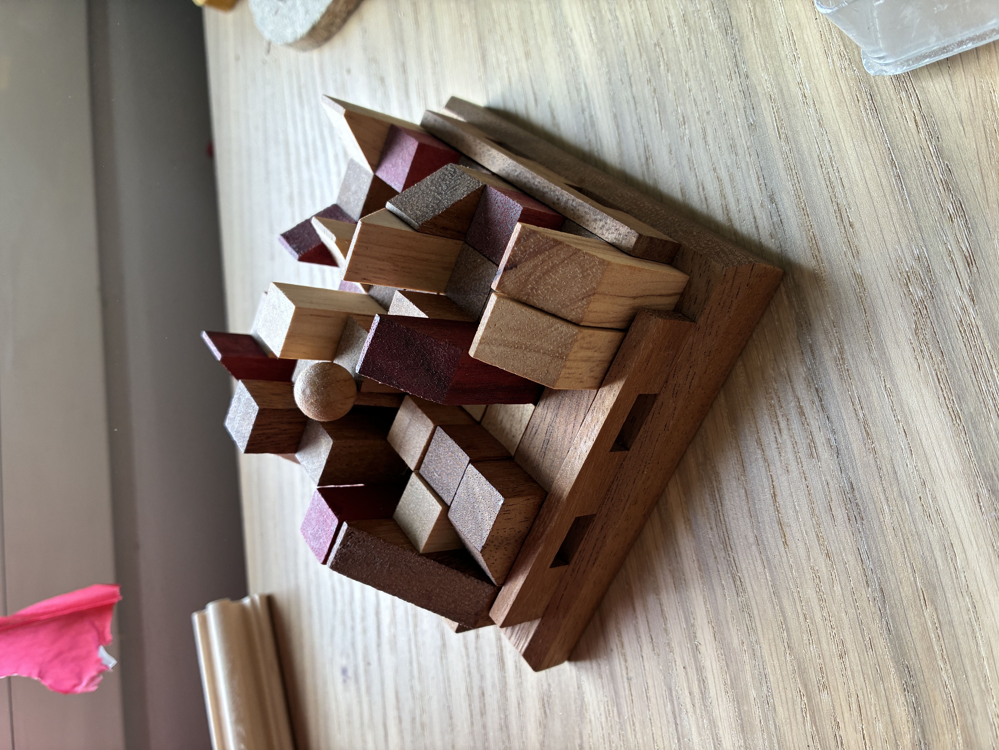

# Juego Puzzle — Buscador de Soluciones

Proyecto personal desarrollado por **Miguel**, de Madrid (España), durante los ratos libres del confinamiento de la pandemia de 2020.

No soy programador profesional — esto es pura curiosidad, ganas de aprender C y el placer de resolver un reto.

---

## ¿Qué es esto?

Tengo un puzzle físico: un tablero de **7×7 casillas** en el que hay que encajar **9 piezas**, cada una colocable en **4 orientaciones** distintas. Además, el tablero tiene una pieza fija ("chincheta") que puede estar en cualquiera de las **49 posiciones** del tablero.

La pregunta que me hice fue: **¿cuántas soluciones tiene este puzzle, y cuáles son?**

Este programa responde exactamente eso.



---

## ¿Cómo funciona?

El programa usa **fuerza bruta con backtracking** y una **lista negra** de combinaciones fallidas para evitar repetir caminos que ya se sabe que no llevan a ninguna solución.

Para cada posición de la chincheta:
1. Genera combinaciones de piezas y orientaciones
2. Intenta colocarlas en el tablero, una a una, buscando el primer hueco libre
3. Si el tablero se bloquea o una pieza no cabe, guarda esa combinación en la lista negra y salta hacia adelante
4. Si todas las piezas encajan → ¡solución encontrada!
5. Continúa hasta agotar todas las combinaciones posibles

---

## Menú del programa

```
1. Títulos de crédito y estado actual
2. Lista de soluciones encontradas
3. Cuadro de bloques ya probados
4. Comenzar a buscar soluciones (se elige la posición de la chincheta)
5. Visualizar una solución encontrada
6. Demo de incremento de punteros
9. Salir
```

---

## Compilación

Proyecto para **Xcode** (macOS), escrito en **C**. Para compilar y ejecutar:

1. Abre `Puzzle_Gen.xcodeproj` con Xcode
2. Compila y ejecuta (Cmd+R)

No tiene dependencias externas.

---

## Estado del proyecto

Funcional. Encuentra todas las soluciones para cada posición de la chincheta.  
El código está siendo revisado y mejorado progresivamente — es un proyecto vivo.

---

## Nota

Esto es un proyecto de aprendizaje y disfrute personal. El código tiene sus "chapuzas" (reconocidas y en proceso de mejora), pero funciona. Si te resulta útil, curioso, o tienes sugerencias, eres bienvenido.

*Madrid, España — Miguel*
